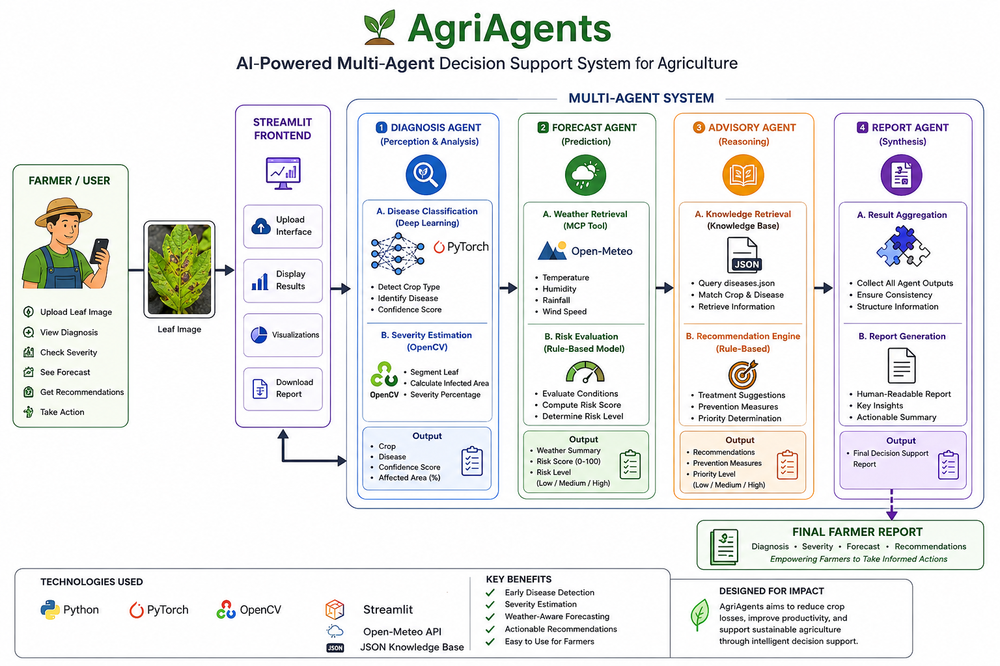
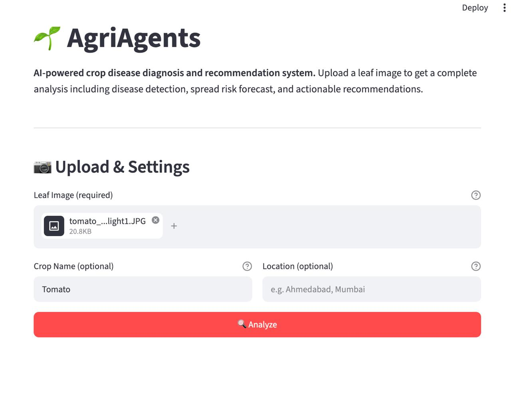
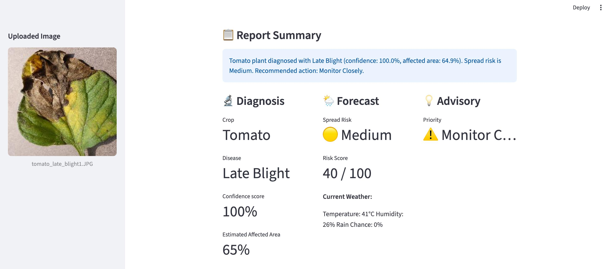
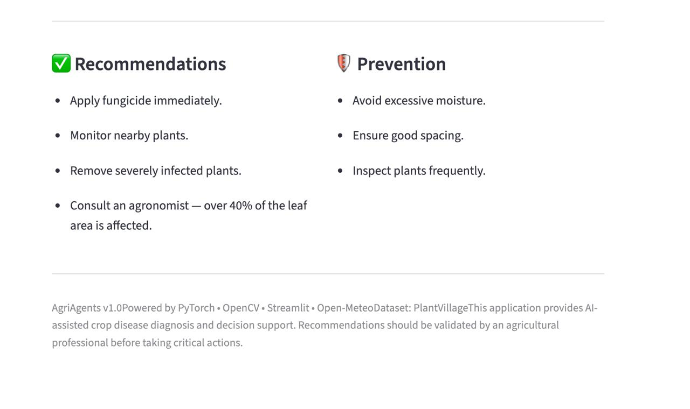

# 🌱 AgriAgents

<div align="center">

# 🌱 AgriAgents

### AI-Powered Multi-Agent Crop Disease Diagnosis & Decision Support System

<p>


</p>

**Combining Computer Vision, Weather Intelligence, and Multi-Agent AI to help farmers detect crop diseases early, estimate infection severity, predict disease spread, and generate actionable treatment recommendations.**

</div>

---

<p align="center">

</p>

---

## 📌 At a Glance

| Feature                         |       Status      |
| ------------------------------- | :---------------: |
| Crop Disease Detection          |         ✅         |
| Severity Estimation (OpenCV)    |         ✅         |
| Weather-Aware Forecasting       |         ✅         |
| Knowledge-Based Recommendations |         ✅         |
| Multi-Agent Architecture        |         ✅         |
| Streamlit Web Interface         |         ✅         |
| Automated Testing               | ✅ 32 Tests Passed |

---


AgriAgents combines **Computer Vision**, **Multi-Agent AI**, **Weather Intelligence**, and a **Knowledge Base** to help farmers detect crop diseases early, estimate infection severity, predict disease spread, and receive actionable recommendations through a simple and intuitive interface.

---

# 📈 Project Statistics

| Metric           |        Value |
| ---------------- | -----------: |
| Supported Crops  |            3 |
| Disease Classes  |           15 |
| AI Agents        |            4 |
| MCP Tools        |            3 |
| Model Accuracy   |       99.46% |
| Passing Tests    |           32 |
| Dataset          | PlantVillage |
| Backend          |       Python |
| Frontend         |    Streamlit |
| Computer Vision  |       OpenCV |
| Weather Provider |   Open-Meteo |
| Machine Learning |      PyTorch |


## 🚀 Project Overview

Crop diseases are responsible for significant agricultural losses worldwide. Many farmers rely on manual inspection or expert consultation, which can be time-consuming, costly, and inaccessible in remote areas. Delayed diagnosis often allows diseases to spread rapidly, reducing crop yield and increasing treatment costs.

AgriAgents addresses this challenge by providing an intelligent decision support system capable of analyzing leaf images, estimating disease severity, considering current weather conditions, and generating practical recommendations to support informed agricultural decisions.

Unlike traditional image classification systems, AgriAgents follows a **multi-agent architecture**, where specialized AI agents collaborate to produce a comprehensive diagnosis rather than a single prediction.

---

# 🌍 The Story Behind AgriAgents

AgriAgents began long before I started studying Computer Engineering.

Growing up, I spent part of my childhood in a rural farming community, where I regularly worked alongside my uncle on his farm. Like many small-scale farmers, he faced recurring challenges caused by crop diseases. Disease identification relied mostly on experience, access to agricultural experts was limited, and treatment decisions were often made after significant damage had already occurred.

Watching months of hard work affected by diseases that might have been managed earlier left a lasting impression on me. My uncle often hoped that someone in our family would one day study agricultural engineering and develop practical solutions that could help farmers like him improve crop health and productivity.

Although my academic journey eventually led me toward Computer Engineering and Artificial Intelligence instead of agricultural engineering, I made a personal promise that one day I would use the skills I developed to contribute to solving those same challenges.

AgriAgents is the first realization of that promise.

It represents the intersection of my personal experience, my passion for Artificial Intelligence, and my commitment to building technology that addresses real-world problems. By combining computer vision, weather intelligence, knowledge-based reasoning, and a modular multi-agent architecture, AgriAgents aims to provide farmers with practical decision support that is accessible, explainable, and actionable.

For me, this project is more than a technical achievement—it is an opportunity to transform a childhood experience into a solution that can positively impact farming communities.


# 🎯 Problem Statement

Farmers face several challenges when managing crop diseases:

* Difficulty identifying diseases at an early stage.
* Limited access to agricultural experts.
* Lack of information about disease severity.
* Uncertainty about how weather conditions influence disease spread.
* Difficulty choosing appropriate treatment and prevention strategies.

Existing crop disease classifiers generally stop after predicting the disease label. They rarely explain the severity of infection, estimate future spread, or provide structured recommendations for decision making.

---

# 💡 Proposed Solution

AgriAgents extends traditional crop disease classification by integrating multiple specialized agents into a single intelligent workflow.

The system:

* Detects crop species and disease using a trained deep learning model.
* Estimates the percentage of infected leaf area using OpenCV image processing.
* Retrieves current weather conditions to evaluate disease spread risk.
* Consults an agricultural knowledge base to generate recommendations and prevention strategies.
* Produces a comprehensive report that assists farmers in making timely and informed decisions.

By combining these capabilities into a modular multi-agent system, AgriAgents transforms image classification into a complete agricultural decision support platform.


# ✨ Key Features

AgriAgents provides an end-to-end intelligent crop disease diagnosis and decision support workflow through the collaboration of multiple specialized AI agents.

### 🌿 Crop & Disease Identification

* Detects crop species and diseases from leaf images using a deep learning model trained on the PlantVillage dataset.
* Supports Tomato, Potato, and Corn crops.
* Provides confidence scores for every prediction.

---

### 📊 Disease Severity Estimation

* Uses OpenCV image processing to estimate the percentage of the infected leaf area.
* Provides quantitative severity information instead of only a disease label.
* Helps prioritize treatment based on the extent of infection.

---

### 🌦 Weather-Aware Disease Spread Forecasting

* Retrieves real-time weather conditions using the Open-Meteo API.
* Evaluates environmental factors such as temperature, humidity, and rainfall.
* Estimates the potential risk of disease spread using an explainable rule-based scoring system.

---

### 📚 Knowledge-Based Recommendations

* Uses a structured agricultural knowledge base to generate recommendations.
* Suggests treatment strategies.
* Provides preventive measures to reduce future outbreaks.

---

### 📄 Comprehensive Decision Support Report

* Combines diagnosis, severity estimation, weather analysis, and recommendations into a single report.
* Presents information in a simple and intuitive format suitable for farmers and agricultural professionals.

---

### 🧩 Modular Multi-Agent Architecture

* Independent AI agents perform specialized tasks.
* Each component can be improved or replaced without affecting the rest of the system.
* Designed for scalability and future expansion to additional crops and diseases.

---

# 🏗 Multi-Agent Architecture

AgriAgents follows a modular multi-agent architecture in which each agent is responsible for a specific stage of the decision-making process. Rather than relying on a single monolithic model, specialized agents collaborate to produce an explainable and comprehensive agricultural diagnosis.

## Agent Responsibilities

### 🔍 Diagnosis Agent

Responsibilities

* Detect crop species.
* Identify plant disease.
* Estimate affected leaf area using OpenCV.
* Produce structured diagnosis results.

Output

* Crop
* Disease
* Confidence Score
* Estimated Affected Area

---

### 🌦 Forecast Agent

Responsibilities

* Retrieve current weather conditions.
* Evaluate environmental factors.
* Estimate disease spread risk.

Output

* Temperature
* Humidity
* Rain Probability
* Risk Score
* Spread Risk Level

---

### 🌱 Advisory Agent

Responsibilities

* Query the agricultural knowledge base.
* Generate treatment recommendations.
* Generate prevention strategies.
* Determine intervention priority.

Output

* Recommendations
* Prevention Measures
* Priority Level

---

### 📋 Report Agent

Responsibilities

* Aggregate outputs from all agents.
* Generate a comprehensive farmer-friendly report.
* Present all results through the Streamlit interface.

Output

* Final Decision Support Report

---

# 🤖 Multi-Agent Workflow

```text
                    Farmer
                       │
                       ▼
                Upload Leaf Image
                       │
                       ▼
              Diagnosis Agent
                       │
         ┌─────────────┴─────────────┐
         ▼                           ▼
 Disease Classification      OpenCV Severity Estimation
         └─────────────┬─────────────┘
                       ▼
               Diagnosis Result
                       │
                       ▼
               Forecast Agent
                       │
                Weather MCP Tool
                       ▼
               Spread Risk Score
                       │
                       ▼
               Advisory Agent
                       │
            Knowledge Base Tool
                       ▼
       Recommendations & Prevention
                       │
                       ▼
                 Report Agent
                       │
                       ▼
              Streamlit Frontend
                       │
                       ▼
                  Final Farmer Report
```

### End-to-End Workflow

1. The farmer uploads a leaf image.
2. The Diagnosis Agent identifies the crop and disease and estimates the affected leaf area.
3. The Forecast Agent retrieves weather information and evaluates disease spread risk.
4. The Advisory Agent consults the knowledge base to generate treatment and prevention recommendations.
5. The Report Agent combines all outputs into a comprehensive agricultural report.
6. The Streamlit application presents the results through a simple and user-friendly interface.

7. The Streamlit interface presents the results to the farmer.

# 🏗 System Architecture

AgriAgents follows a modular multi-agent architecture where specialized AI agents collaborate to provide comprehensive crop disease diagnosis and decision support.

Each agent performs an independent task, making the system easier to maintain, test, and extend.

<p align="center">
  
</p>

# 🛠 Technology Stack

| Category | Technologies |
|-----------|--------------|
| Programming Language | Python 3.13 |
| Machine Learning | PyTorch |
| Computer Vision | OpenCV |
| User Interface | Streamlit |
| Weather Intelligence | Open-Meteo API |
| Knowledge Base | JSON |
| Testing | Pytest |
| Version Control | Git & GitHub |
| Dataset | PlantVillage |

# ⚙ Installation

Clone the repository

```bash
git clone https://github.com/edmondapetogbo/AgriAgents.git

cd AgriAgents
```

Create a virtual environment

```bash
python -m venv .venv
```

Activate it

macOS/Linux

```bash
source .venv/bin/activate
```

Windows

```bash
.venv\Scripts\activate
```

Install dependencies

```bash
pip install -r requirements.txt
```

# 🚀 Usage

Launch the Streamlit application

```bash
streamlit run frontend/app.py
```

Upload a leaf image and the system will automatically:

- Detect the crop
- Diagnose the disease
- Estimate affected area
- Evaluate weather conditions
- Predict spread risk
- Generate treatment recommendations
- Produce a comprehensive report

# 🧪 Testing

Run all tests

```bash
pytest
```

Current Status

✅ 32 tests passed

The test suite validates:

- Disease detection
- Severity estimation
- Diagnosis Agent
- Forecast Agent
- Advisory Agent
- Weather tool
- Knowledge Base
- Model integration

# 🖼 Application Preview

## Home Screen

The Streamlit interface allows farmers to upload a leaf image, optionally specify the crop and location, and initiate the AI-powered diagnosis.

<p align="center">
  
</p>

---

## Diagnosis and Summary Report

After analysis, AgriAgents provides a comprehensive decision support report that includes disease identification, confidence score, estimated affected area, weather-aware spread risk, treatment recommendations, and preventive measures.

<p align="center">
  
</p>

<p align="center">
  
</p>

# 🛣 Roadmap

The following roadmap outlines the planned evolution of AgriAgents.

## ✅ Version 1.0 (Completed)

- Multi-agent architecture
- Deep learning disease classification
- OpenCV severity estimation
- Weather-aware disease forecasting
- Knowledge-based recommendations
- Comprehensive report generation
- Streamlit web application
- Automated testing suite

---

## 🚧 Version 2.0

- Support for additional crops
- Disease progression visualization
- Farmer history dashboard
- Offline diagnosis mode
- Multi-language support
- Improved recommendation engine

---

## 🌍 Version 3.0

- Mobile application (Android & iOS)
- Satellite imagery integration
- Drone image analysis
- IoT sensor integration
- Voice assistant for farmers
- Cloud deployment

# 🔮 Future Improvements

AgriAgents has been designed as a scalable research project.

Future enhancements include:

- Expanding support to additional crops and diseases.
- Integrating Large Language Models (LLMs) for conversational agricultural assistance.
- Predicting disease progression over time.
- Personalized recommendations based on farm history.
- GPS-based disease outbreak visualization.
- Cloud deployment for real-time access.
- Mobile application for offline rural environments.
- Integration with agricultural IoT devices.

# 👨‍💻 Author's Note

AgriAgents began as more than a software engineering project.

It represents a personal commitment to applying Artificial Intelligence to challenges I witnessed firsthand while growing up in a farming community. Working alongside my uncle on his farm showed me how crop diseases could threaten an entire season's harvest and how difficult it could be for farmers to access timely diagnostic support.

Although I pursued Computer Engineering instead of Agricultural Engineering, my goal remained the same—to use technology to improve agricultural decision-making.

AgriAgents is one step toward that vision.

I hope this project demonstrates how Artificial Intelligence can become a practical tool that empowers farmers, improves productivity, and contributes to more sustainable agriculture.

# 🙏 Acknowledgements

This project would not have been possible without:

- The PlantVillage dataset.
- The PyTorch community.
- OpenCV contributors.
- Streamlit developers.
- Open-Meteo for weather data.
- Gujarat Technological University (GTU).
- OpenAI for technical guidance during project development.


# 🎓 Research Contribution

AgriAgents demonstrates how multiple AI techniques can be combined into a unified agricultural decision support system.

The project integrates:

* Deep Learning for crop disease classification.
* Computer Vision for disease severity estimation.
* Weather intelligence for disease spread forecasting.
* Knowledge-based reasoning for agricultural recommendations.
* Multi-agent software architecture for modular decision making.

This modular design allows future researchers and developers to replace or improve individual agents without redesigning the complete system, making AgriAgents a scalable foundation for future agricultural AI research.

